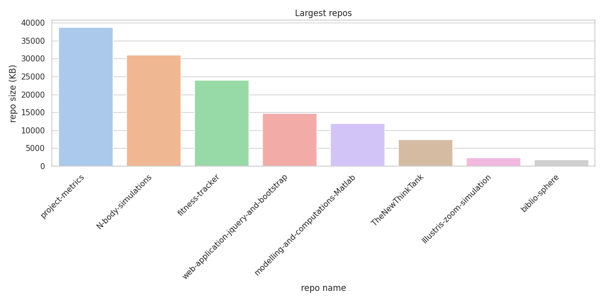
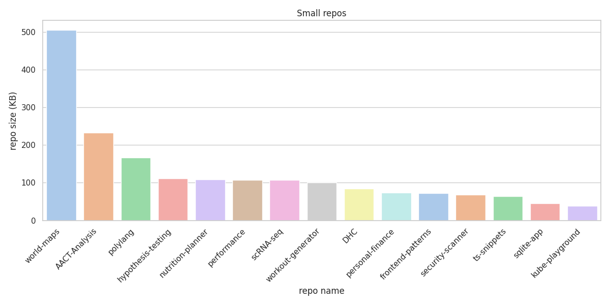

# project-metrics

Overview of projects and their health:

- [popular repos](query-results/popular_repos.md) 
- [repos without description](query-results/repos_wo_desc.md) 
- [repos grouped by language](query-results/group_by_lang.md)

## Current features

- pre commit hooks for:
  - Python auto-formatting with `black`
  - Python import sorting with `isort`
  - trailing-whitespace
  - end-of-file-fixer
  - check-yaml
  - check-added-large-files

- Statistics and health badges
  (commit activity, repo size, code test coverage, documentation status, CI health of workflows)

- Sphinx auto doc, with doc hosting on readthedocs: 
[project-metrics](https://project-metrics.readthedocs.io/en/latest/)

- Automatically checking for updates using `Dependabot`:
  - `pip` (monthly)
  - `GitHub Actions` (weekly)

- GitHub Actions workflow `wf.yml`. NB: as the repo updates itself, the only trigger should be `workflow_dispatch` to avoid recursive workflow invocation.
- The workflow contains the following jobs:
  - `qualify_code`:
    - static type checking with `mypy`
    - code linting with `flake8` and `ruff`
    - spell checking of README
    - linting of YAML files
    - software complexity metrics with `wily`
    - unit tests with `pytest`
    - code coverage reporting
    - caching of `poetry` and `mypy` dependencies

  - `get_metrics`:
    - updates *this* repo's README (links above) with following projects metrics:
      - top 10 most popular GitHub repos, by star count
      - repos lacking any description, across `GitHub` and `GitLab`
      - repos grouped by programming language

  - `update_repos`:
    - updates *all* GitHub repos:
      - All GitHub repos (including this one) get a repo size badge on top of their README 
        NB: does not affect the GitHub profile page, which is a special repo.
      - support for both `.md` and `.rst` files
      - All GitHub repos gets a GitHub Actions workflow, `.github/workflows/wf.yml`,
        containing linting for Python and/or TypeScript code,
        as well as a *CI* badge on their README

the last job, `update_repos`, is further performance tested and a comparison of parallel and threading versions are
provided alongside the serial (for-loop) version: 
- [Performance Benchmarks](BENCHMARKS.md)

## Note on GraphQL

Useful explorer for testing out GraphQL queries:
- [GitHub GraphQL API Explorer](https://docs.github.com/en/graphql/overview/explorer)

## Upcoming features
- linting of R scripts with `lintr`
- cleanup script: `remove_badge.py`
- setup a single, reusable base workflow (poetry setup etc.)
- identify public repos without any README (e.g. 'web-application-jquery-and-bootstrap')
- security scannings with *bandit* (searching for API keys etc.)
- filter repos by number of users, descendingly
- getting codecov above 50 %
- improve & extend documentation on `readthedocs`
- alphabetic sorting of words in `config/.wordlist.txt`
- group by category (using tags), e.g. health (nutrition, fitness, athlete profiler)
- group by repo size, display largest and smallest repos
- group by created_at, display newest and oldest repos
- check if repos have tests
- if so, setup codecov badge on their README's
- if not, set up pytest, perhaps using `cookiecutter` / `cruft` or custom template
